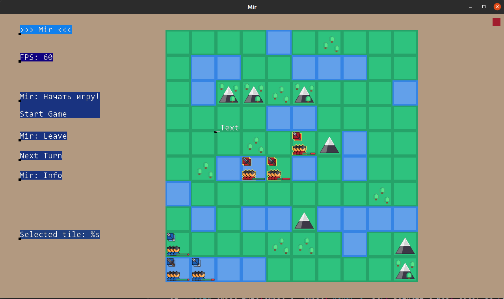

# Build #
	## Windowns ##
	...

	## Linux ##

	```console
	mkdir codeblocks
	cd codeblocks
	cmake -G"Codeblocks - Unix Makefiles" ../
	make
	```


# TODO #

	Add more teams (team's system)
	Add more unit's (cannon, knight)
		Research tree


	Rework tile rendering
	State system (Game states: game start, pause, game end, ...)
	Save/Load game.
	Client/Server (multiplayer)
	Map (level) editor
		Improve map generation (procedure generation)

	Sound Effects, Music

	Improve GUI system (may be use GTK+ or ...)
		Beautify GUI (textures, animations)
		Add check boxes (for choosing team?)
		Show/hide GUI frames.

	Camera zoom in/out, move, (rotate?)

	Different settings (game start settings, sound on/off, full-screen, loading custom tileset/textures, ...)

	Fix textures
		curves (edges, pixel/grid alignment)
		pixels (remove blur)
		broken opacity (99% -> 100%)
		add active unit texture

	Improve AI/Bots.

	Add animations
		camera movement, unit movement, background animations, tile/texture animations, ...

	Add screen resizing.
	Add support of OpenGL ES

	Cleanup
		Remove unused comments
		Remove unused commented code
		Remove unused functions, structure members, includes

	Fix
		Fix memory leaks, heap corruptions, ...
		Fix warnings, UB, unsafe code, ...
		Fix "#include"   

	Move to CMake build system.
	Windows release

	Check using static analysis.

	Добавить корованы
